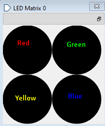
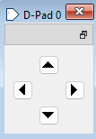
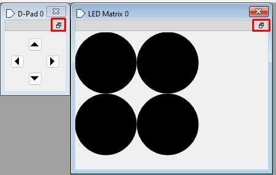

# RISC-V Simon Game

A Simon-style memory game written in RISC-V assembly for the
[Ripes](https://github.com/mortbopet/Ripes) simulator. The program drives a
2x2 LED matrix through memory-mapped I/O and reads player input from a D-pad.

The project demonstrates low-level control flow, direct I/O device interaction,
manual state management, and playable game logic without a high-level runtime.

## Demo

The game uses Ripes' LED Matrix and D-Pad I/O devices:

| LED Matrix | D-Pad |
| --- | --- |
|  |  |

Each color maps to one D-pad direction:

| D-pad input | LED position | Color |
| --- | --- | --- |
| Up | Top left | Red |
| Down | Bottom right | Blue |
| Left | Bottom left | Yellow |
| Right | Top right | Green |

During a round, the LED matrix displays a random color sequence. The player
repeats the sequence using the D-pad. Correct button presses briefly turn the
corresponding LED white. A completed round turns the full matrix white; an
incorrect input turns the matrix purple.

## Features

- Classic Simon gameplay with randomly generated color sequences
- Increasing difficulty as the sequence grows after successful rounds
- Memory-mapped LED Matrix output
- Memory-mapped D-pad input polling
- Success and failure feedback through full-matrix colors
- Ripes user guide with setup screenshots in `docs/documentation.pdf`

## Quick Start

1. Download or clone this repository.
2. Open Ripes.
3. Load `src/simon_game_final.s`.
4. Choose the **Single-cycle processor**.
5. Open the **I/O** section.
6. Add both devices:
   - `LED Matrix`
   - `D-Pad`
7. In the `LED Matrix 0` parameters, set:
   - Height: `2`
   - Width: `2`
   - LED size: `100`, or another comfortable size
8. Return to the editor and press the Start button.

After setup, the floating D-pad and 2x2 LED Matrix windows should look similar
to this:



The full setup walkthrough, including screenshots of the Ripes UI, is available
in [docs/documentation.pdf](docs/documentation.pdf).

## Gameplay

When the program starts, it prints the current level in the console and displays
a sequence on the LED matrix. After the board goes dark, repeat the sequence
with the D-pad.

At the end of each round, the console prompts:

```text
Enter 0 to exit or 1 to play again
```

Enter `1` to continue or `0` to exit. If the game misbehaves after invalid
console input or accidental code edits, reload `src/simon_game_final.s` in Ripes.

## Repository Layout

```text
.
|-- src/
|   `-- simon_game_final.s      # Final RISC-V assembly implementation
|-- development/
|   |-- simon_game_v1.s         # Earlier implementation checkpoint
|   `-- simon_game_v2.s         # Later implementation checkpoint
|-- docs/
|   |-- documentation.pdf       # Full user guide with setup screenshots
|   `-- readme-assets/          # Screenshots extracted from the guide
|-- LICENSE
`-- README.md
```

## Implementation Notes

### Sequence Generation

The game generates random values with a linear congruential generator:

```text
x1 = (a * x0 + b) mod m
```

The implementation uses:

- `a = 1103515245`
- `b = 12345`
- `m = 1073741824`

The current system time syscall is used as the seed source, and each generated
value is reduced modulo `4` to select one of the four D-pad/LED positions.

### Memory Management

The generated sequence is stored as words in heap memory. The program allocates
space for each sequence element, walks through the sequence to display it, and
then walks through it again while validating player input.

### LED Output

The `setLED` helper computes the address of a pixel in the LED matrix from its
`x` and `y` coordinates:

```text
LED address = LED_MATRIX_0_BASE + ((y * LED_MATRIX_0_WIDTH + x) * 4)
```

It then writes a 24-bit RGB color value directly to that address.

### Input Handling

The `pollDpad` helper repeatedly checks the D-pad memory-mapped input registers
until a button is pressed. It waits for the button to be released before
returning, which prevents one press from being counted multiple times.

## Development Process

The project was built incrementally:

1. Generate and display LED sequences.
2. Add D-pad input validation.
3. Improve sequence randomization with an LCG.
4. Add level progression and success/failure feedback.

The `development/` directory contains earlier versions that show this
progression.

## License

This project is licensed under the MIT License.
